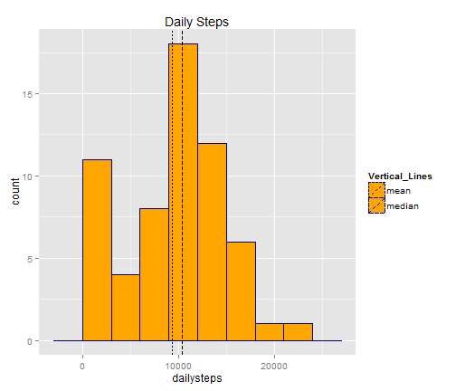
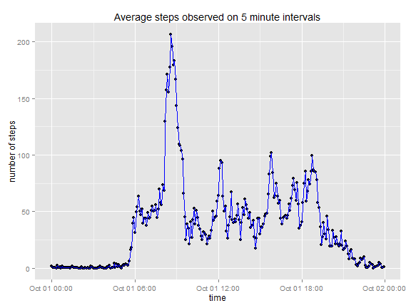
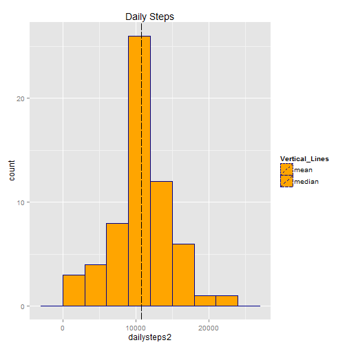
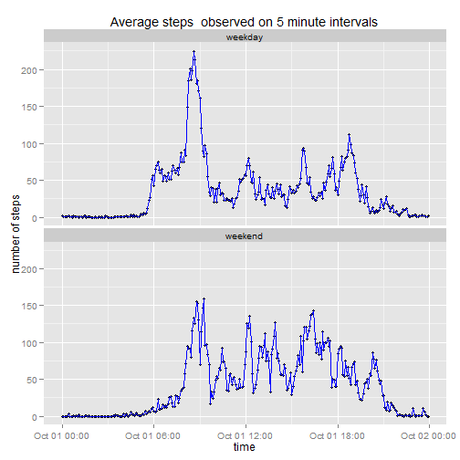

## Objective

Analyze the number of steps taken by a person in 5 minute intervals. 


## Loading the data

The first step is to load the data and save it into an R object.


```r
act<-read.csv("activity.csv")
```


## Mean total number of steps

To obtain a first idea about the data, is useful to plot an histogram of the total number of steps taken per day.


```r
dailysteps<-tapply(act$steps,act$date,sum,na.rm=TRUE)
library(ggplot2)
dsf<-data.frame(dailysteps)
mn<-mean(dailysteps)
md<-median(dailysteps)
mm<-as.data.frame(c(mn,md))
names(mm)<-"par"
mm$cat<-factor(c("mean","median")) #for the 2 vertical lines
dsf$Vertical_Lines<-factor(rep("1",61)) #artificial factor needed to make a legend

g<-ggplot(dsf,aes(x=dailysteps,linetype=Vertical_Lines))
g2<-g+geom_histogram(fill="orange",colour="darkblue",binwidth=3000)+
  labs(title = "Daily Steps")+
  geom_vline(data=mm,aes(xintercept=par,linetype=cat))+
  scale_linetype_discrete(breaks=c("mean","median")) #removes artificial factor from legend
  #ggsave(filename="p1dsteps.png",width=5,height=4)
```
The graph is:

```r
print(g2)
```

 

The graphs also shows the mean and the median of the daily steps.
The values are:

```r
cat("mean = ", mn)
```

```
## mean =  9354
```

```r
cat("median = ", md)
```

```
## median =  10395
```
The graph shows the following:
 
1. Two modes, one around zero and another one around the median
2. The median is bigger than the mean.

These 2 observations could be due to the fact that incomplete data (NA) are not contibuting to the totals and showing many days with very low or null counts.


## Average daily activity

Next, to find patterns of behavior we can look at a graph of the steps on 5 minute intervals averaging over all observed days. 


```r
intervalnumber<-0:(nrow(act)-1)
act$intervalclass<-factor(intervalnumber%%288) #marks same intervals with reminder function
intmeans<-tapply(act$steps,act$intervalclass,mean,na.rm=TRUE)
intmeans2<-as.data.frame(intmeans)
d0<-toString(act$date[1])
t0<-as.POSIXlt(d0) ##initial date-time, for plots   
l<-dim(intmeans2)[1]
intmeans2$times<-as.POSIXct(seq.POSIXt(from=t0,by="5 min",length.out=l)) #initial times of intervals

p2<-ggplot(intmeans2,aes(x=times,y=intmeans))
p2m<-p2+labs(title = "Average steps observed on 5 minute intervals")+
  geom_point()+
  geom_line(size=.4,col="blue")+
  labs(x="time",y="number of steps")
```
The graph is:

```r
print(p2m)
```

 

The graph shows a clear maximum. Its value and the time at which they are observed are:

```r
max(intmeans2$intmeans)
```

```
## [1] 206.2
```

```r
intmeans2$times[which.max(intmeans2$intmeans)]
```

```
## [1] "2012-10-01 08:35:00 CDT"
```
 

## Effect of missing values

In order to understand the effect of missing values, let's see its number. 

```r
table(is.na(act))
```

```
## 
## FALSE  TRUE 
## 67968  2304
```

```r
table(is.na(act$steps))
```

```
## 
## FALSE  TRUE 
## 15264  2304
```

```r
mean(is.na(act$steps))
```

```
## [1] 0.1311
```
Since the total number of missing values coincides with the number of missing values in the variable steps, we can conclude that all the missing values show on this variable. There is a 13% of missing values in act$steps, so they cannot be ignored.

The previous graph shows that the time of the day has strong influence on steps taken. In order to maintain this property, missing values of steps during a 5 minute interval are been replaced by the mean value at the same interval, averaged across all available days.


```r
act2<-act
nal<-which(is.na(act2$steps))
nal2<- nal%%288
act2$steps[nal]<-intmeans2$intmeans[nal2]
```

```
## Warning: number of items to replace is not a multiple of replacement
## length
```
After this, all missing values are replaced:


```r
table(is.na(act2$steps))
```

```
## 
## FALSE 
## 17568
```
We can now observe the distribution of daily number of steps eliminating the effect of missing values.

```r
dailysteps2<-tapply(act2$steps,act2$date,sum)
dsf2<-data.frame(dailysteps2)
mn2<-mean(dailysteps2)
md2<-median(dailysteps2)
mm2<-as.data.frame(c(mn2,md2))
names(mm2)<-"par"
mm2$cat<-factor(c("mean","median")) #for the 2 vertical lines
dsf2$Vertical_Lines<-factor(rep("1",61)) #artificial factor needed to make a legend

p3<-ggplot(dsf2,aes(x=dailysteps2,linetype=Vertical_Lines))
p3m<-p3+geom_histogram(fill="orange",colour="darkblue",binwidth=3000)+
  labs(title = "Daily Steps")+
  geom_vline(data=mm2,aes(xintercept=par,linetype=cat))+
  scale_linetype_discrete(breaks=c("mean","median")) #removes artificial factor from legend
  #ggsave(filename="p3dsteps.png",width=5,height=4)
print(p3m)
```

 


This histogram is clearly unimodal, the mean and the median are overlapped in the graph. They are almost the same:

```r
cat("mean = ", mn2)
```

```
## mean =  10766
```

```r
cat("median = ", md2)
```

```
## median =  10765
```
Replacement of missing values eliminated the mode with null or very low values. Nevertheless, the graph shows that the left tail (low values) is heavier than the right tail (high values). This could be explained if a difference between weekdays and weekends were observed.


## Effect of weekends

To see the effect that weekends vs weekdays, the data frame needs to be extended to include this information.


```r
intervalnumber2<-0:(nrow(act2)-1)
intervalclass2<-factor(intervalnumber2%%288)     ##identifiesninterval for average
library(reshape2)

wd<-weekdays(as.POSIXlt(as.character(act2$date))) ##day of the week for every observation
ind<- wd %in% unique(wd)[6:7]                     ##identifier of "Saturdays" and "Sundays"
act2$week<-factor("weekday")                      ## intialize everything as "weekday"
levels(act2$week)<-c("weekday","weekend") 
act2$week[ind]<-"weekend"                         ## identify "weekends"
factorslist<-list(intervalclass2,act2$week)
means1<-tapply(act2$steps,factorslist,mean)       ##means across days of same type
d0<-as.character(act2$date[1])
t0<-as.POSIXlt(d0)                                ##initial time
l<-nrow(means1)
means2<-data.frame(weekday=means1[,1],weekend=means1[,2],time=as.POSIXct(seq.POSIXt(from=t0,
                                          by="5 min",length.out=l)))
means3<-melt(means2,id.vars = "time")             ## change to long format
```
Then, the average steps can be plotted.

```r
p4<-ggplot(means3,aes(x=time,y=value))
p4m<-p4+labs(title = "Average steps  observed on 5 minute intervals")+
  geom_point(size=1.2)+
  geom_line(size=.4,col="blue")+
  labs(x="time",y="number of steps")+
  facet_wrap(~variable,nrow = 2, ncol = 1)
  print(p4m)
```

 


The shape of the graph on weekdays and weekends are similar. Weekdays show higher number of steps.

